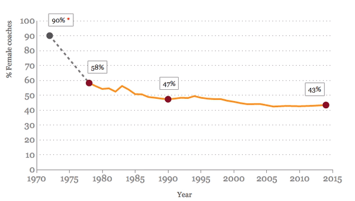

# GIFME

A little command line utility to wrap around some clever ffmpeg commands I lifted from [this great blog post](http://blog.pkh.me/p/21-high-quality-gif-with-ffmpeg.html#usage).

Requires [ffmpeg]() as a dependency.

The defaults will produce high quality gifs at a very small file size when making gifs from screencaptured video.

Example:

This command makes a gif from a quicktime screencapture called `screencapture.mov` beginning at the 10 second mark and lasting 6 seconds. The gif will be 600px wide and aspect ratio will be preserved. We'll call the output gif `chart.gif`.

`./gifme.sh -s 00:00:10 -d 6 -w 600 screencapture.mov chart.gif`

If you need to reduce the file size further, try reducing the size, then the framerate, and then mess with the dithering options to get the size you need.

usage: gifme [-s start time ] [-d duration ] [ -w width ]
[ -f frames per second ] [ -b bayer scale filter] [INPUT FILE] [OUTPUT FILE]

Cut a video file and output a gif. The only required argument is the input
file argument.

**Positional arguments:**
- INPUT FILE  
    A video file of (nearly) any format with extension
included.

- OUTPUT FILE  
  A .gif file to be written to disk. Defaults to 'output_gif.gif'. Optional.

**Optional arguments:**

- -h HELP  
  Shows this message.

- -s START TIME  
  Timecode to start gif. Uses format HH:MM:SS and can accept fractional seconds. Defaults to 00:00:00.

- -d DURATION  
Duration of gif in seconds or format HH:MM:SS.
Can accept fractional seconds. Defaults to 5.

- -w WIDTH  
A number, in pixels, representing desired width of output gif. Maintains aspect ratio. Defaults to -1 which is how ffmpeg represents maximum width.

- -f FRAMES PER SECOND  
A number 1-30 representing desired gif frames per
second. Defaults to 15.

- -b BAYER SCALE  
A number 1-3 representing desired Bayer Scale dithering filter. The Bayer Scale is responsible for the 'cross-hatch' overlay. A larger cross-hatch may speed up rendering and reduce filesize. Defaults to none. 1 is the smallest cross-hatch, 3 is the largest.

- -o DITHERING OFF  
Turns off dithering. Do not use this option with -b or the results may be unexpected.
